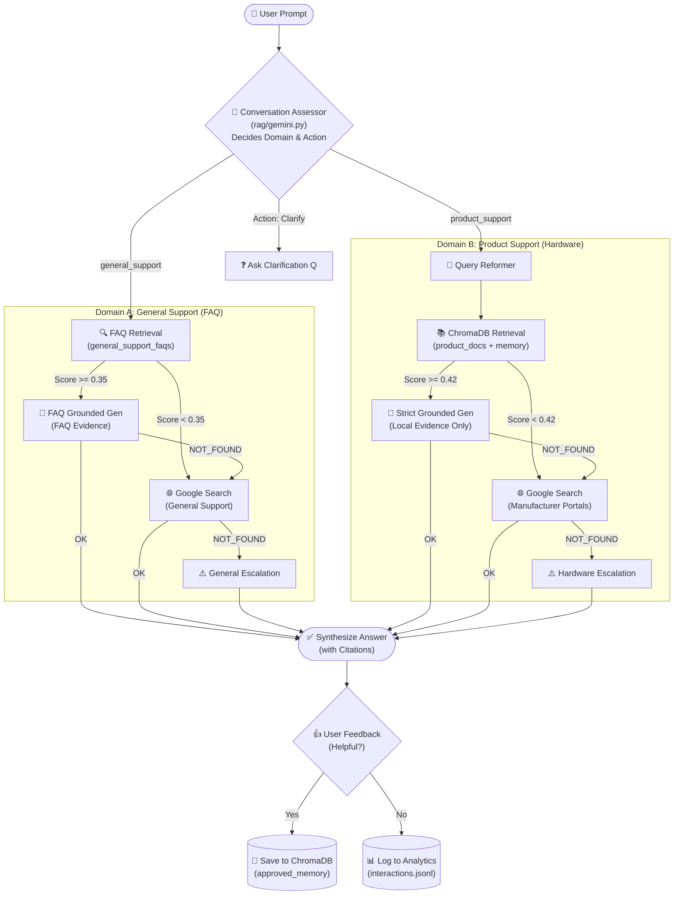

# Intelligent Product Support Assistant — System Architecture & Developer Handoff

> **Document Purpose**: This comprehensive specification is crafted for AI agents and engineering collaborators (such as Claude) to immediately grasp the system architecture, code organization, runtime data flows, design invariants, and strategic roadmap of the **Intelligent Product Support Assistant**.

---

## 1. Executive Summary & Core Objective

The **Intelligent Product Support Assistant** is a local-first, version-aware, Retrieval-Augmented Generation (RAG) system engineered for high-precision technical support of consumer electronics, IoT devices, and computer hardware — plus general customer service coverage for account, order, shipping, returns, and refund inquiries.

### Key Value Proposition
1. **Zero-Hallucination Hardware Grounding**: Incorrect hardware instructions (e.g., wrong reset button sequences, mismatched voltage instructions, or invalid firmware flashes) can permanently brick customer devices. The system enforces strict citation grounding and escalates gracefully rather than guessing.
2. **Hardware Version & Revision Awareness**: A TP-Link Archer AX21 V1.0 often has completely different firmware, LEDs, and reset behaviors than V2.0 or V3.0. The retriever isolates documents by exact `hardware_version` metadata.
3. **Dual-Domain, Multi-Tier Evidence Retrieval**:
   - **Domain A — Product Support** (hardware troubleshooting):
     - Tier 1: `product_documents` (official manuals) + `approved_interactions` (verified memory) in ChromaDB
     - Tier 2: Google Search Grounding restricted to official manufacturer portals
     - Tier 3: Safe escalation with manufacturer support links
   - **Domain B — General Support** (account, orders, shipping, returns, refunds):
     - Tier 1: `general_support_faqs` collection in ChromaDB (686 curated Q&A pairs from MakTek + Bitext datasets)
     - Tier 2: Google Search Grounding for general customer service
     - Tier 3: Safe escalation to customer support contact
4. **Intelligent Domain Router**: The conversation assessor classifies each question into `product_support` or `general_support` before retrieval, preventing the system from asking "what device are you using?" when someone asks about return policies.
5. **Self-Improving Verified Memory**: User feedback (Helpful / Not helpful) promotes verified Q&A interactions into a secondary memory vector collection without contaminating immutable official documentation.

---

## 2. Technology Stack

| Layer | Technologies / Libraries |
|---|---|
| **Language & Environment** | Python 3.11+ / 3.12 / 3.14 (macOS/Linux), `pyproject.toml` |
| **Frontend UI** | Streamlit (Custom Dark Charcoal GPT-minimalist design, zero unnecessary chrome) |
| **LLM & Vision** | Google Gemini 2.5 Flash / Flash Lite via the official `google-genai` SDK |
| **Embeddings** | Gemini `gemini-embedding-001` (Task types: `RETRIEVAL_DOCUMENT` vs `RETRIEVAL_QUERY`) |
| **Vector Store** | ChromaDB (`chromadb.PersistentClient`) with local SQLite persistence — 3 collections |
| **Document Ingestion** | `pypdf`, Markdown/Plaintext splitters, FAQ JSONL parser |
| **Web Scraping** | `BeautifulSoup4`, `requests` |
| **FAQ Datasets** | MakTek (200 pairs), Bitext (486 sampled from 26,872) — via HuggingFace |
| **Testing & Evaluation** | `pytest`, custom Golden Question evaluation pipeline (11 test cases) |

---

## 3. System Architecture & End-to-End Data Flow



---

## 4. Codebase Anatomy

```
Intelligent Product Support Assistant/
├── app.py                      # Streamlit chat UI, session state, auto-ingestion, FAQ auto-indexing
├── pyproject.toml              # Build dependencies & project configuration
├── README.md                   # User documentation and setup guide
├── PROJECT_OVERVIEW.md         # This technical specification for AI agent handoff
│
├── rag/                        # Core RAG Library
│   ├── __init__.py
│   ├── config.py               # Paths, 3 collection names, 2 similarity thresholds, model names
│   ├── models.py               # Dataclasses: ProductEntity, RetrievedChunk, Citation, ChatResult
│   ├── gemini.py               # Gemini SDK: embeddings, generation, search grounding, domain-aware assessor
│   ├── retriever.py            # ChromaDB queries: retrieve_documents(), retrieve_approved_memory(), retrieve_faq()
│   ├── indexer.py              # Embedding & indexing: index_documents(), add_approved_memory(), index_faq_pairs()
│   ├── loader.py               # Document loaders (PDF, TXT, MD) & text chunkers
│   ├── sources.py              # Web fetcher (BS4) and upload storage manager
│   ├── interactions.py         # Logging to interactions.jsonl & promotion of helpful Q&As to memory
│   ├── chatbot.py              # ProductAssistant orchestrator with dual-path domain routing
│   └── ocr.py                  # Vision & OCR utilities for hardware labels and port diagrams
│
├── scripts/                    # One-time setup & data preparation
│   └── prepare_faq_data.py     # Downloads MakTek + Bitext, normalizes, samples, outputs JSONL
│
├── data/                       # Local data persistence
│   ├── chats.json              # Persistent conversation sessions surviving app restarts
│   ├── interactions.jsonl      # Audit trail of questions, answers, citations, and user feedback
│   ├── faq/                    # General support FAQ data
│   │   └── general_support_faqs.jsonl  # 686 curated Q&A pairs (200 MakTek + 486 Bitext)
│   ├── products/               # Product manuals categorized by slugified product_id
│   └── examples/               # Reference device documentation (e.g. TP-Link Archer AX21)
│
├── chroma_store/               # ChromaDB SQLite and vector binary storage directory
│                               # Collections: product_documents, approved_interactions, general_support_faqs
│
├── evaluation/                 # Automated accuracy & safety evaluation
│   ├── golden_questions.csv    # 11 test cases: 5 hardware + 6 general support
│   └── run_eval.py             # Evaluation runner asserting pass/fail against live LLM responses
│
└── tests/                      # Pytest unit & integration test suite
    ├── test_chatbot.py
    ├── test_loader.py
    └── test_retriever.py
```

---

## 5. Detailed Component Breakdown

### 5.1 `rag/chatbot.py` (`ProductAssistant`)
The central orchestrator implementing **dual-path domain routing**:

1. **Conversation Assessment**: Calls `assess_conversation()` which returns both `action` ("answer"/"clarify") and `question_domain` ("product_support"/"general_support"). If clarification is needed, returns a follow-up question.
2. **Domain Routing**:
   - **`general_support`**: Routes to `_answer_general_support()` → queries `general_support_faqs` collection (no product/version filtering) → Google Search fallback → general escalation.
   - **`product_support`**: Routes to `_answer_product_support()` → queries `product_documents` + `approved_interactions` with version-aware filtering → Google Search fallback → hardware escalation.
3. **FAQ Path** (`_answer_general_support`):
   - Retrieves from `general_support_faqs` with threshold `MIN_FAQ_SIMILARITY` (0.35).
   - Uses `FAQ_SYSTEM_INSTRUCTIONS` prompt (simpler, no hardware version awareness).
   - Returns category-based citations (e.g., "Order", "Refund", "Account").
4. **Product Path** (`_answer_product_support`):
   - Unchanged from original: version-aware retrieval, strict grounding, `SYSTEM_INSTRUCTIONS` prompt.
   - Threshold `MIN_DOCUMENT_SIMILARITY` (0.42).
5. **Graceful Quota Handling**: Catches 429 quota exhaustion errors during search grounding and safely escalates.

### 5.2 `rag/gemini.py` — Conversation Assessor
The `assess_conversation()` function now classifies `question_domain` alongside deciding whether to clarify or answer:
- **`product_support`**: Hardware troubleshooting, firmware, setup, connectivity, specs — requires knowing a product model.
- **`general_support`**: Account, orders, shipping, delivery, returns, refunds, payments, invoices, cancellation, passwords, newsletters, contacting support — does NOT require a product model.
- Hard rule: if `question_domain == "general_support"`, action is forced to `"answer"` (never asks for device model on policy questions).

### 5.3 `rag/indexer.py` & `rag/retriever.py`
Manages **three** distinct ChromaDB collections:
1. `product_documents`: Immutable official documentation chunks. Filtered by `product_id` + `hardware_version`.
2. `approved_interactions`: User-validated historical answers promoted through positive feedback. Filtered by `product_id`.
3. `general_support_faqs`: Pre-embedded FAQ Q&A pairs from MakTek + Bitext datasets. **No product filtering** — queries match against all 686 pairs.

Key methods:
- `index_faq_pairs(faq_path)`: Reads JSONL, embeds Q&A text, stores with category/intent metadata.
- `retrieve_faq(query, top_k=3)`: Cosine similarity search across all FAQ pairs, no metadata filters.

### 5.4 `rag/interactions.py`
- Records every query, response, citation list, escalation status, and feedback to `data/interactions.jsonl`.
- `submit_feedback(interaction_id, helpful=True)`: Validates that the answer was not an escalation, contains valid citations, and stores the verified (Question, Answer, Source URLs) tuple into `approved_interactions` in ChromaDB.

### 5.5 `app.py` (Streamlit Frontend)
- **GPT-Minimalist Dark Charcoal Theme**: Custom CSS palette (`#16181D` background, `#0F1014` sidebar, `#1E2129` assistant card container, `#2D323E` right-aligned user bubble).
- **FAQ Auto-Indexing**: `ensure_faq_index()` runs once on startup (via `@st.cache_resource`) — checks if `general_support_faqs` collection is empty and indexes from `data/faq/general_support_faqs.jsonl` if needed.
- **Persistent Chat History**: Stores active and past chats in `data/chats.json`.
- **Seamless Attachment**: "+ Add documentation" popover accepts PDF/TXT/MD files or documentation URLs.
- **Copy on Hover**: Embedded HTML/JS copy button on hover for all chat bubbles.

### 5.6 FAQ Data Pipeline (`scripts/prepare_faq_data.py`)
One-time data preparation script:
1. Downloads **MakTek** dataset (200 clean Q&A pairs) from HuggingFace.
2. Downloads **Bitext** dataset (26,872 intent-tagged pairs) from HuggingFace.
3. Uses all 200 MakTek pairs.
4. Stratified-samples 18 pairs per intent × 27 intents = 486 Bitext pairs with deliberate colloquial/messy phrasing diversity.
5. Replaces Bitext template placeholders (`{{Order Number}}` → `#ORD-29481`, etc.) with realistic values.
6. Outputs combined 686 pairs to `data/faq/general_support_faqs.jsonl`.

---

## 6. ChromaDB Collections Reference

| Collection | Constant | Records | Filtering | Similarity Threshold | Purpose |
|---|---|---|---|---|---|
| `product_documents` | `DOCUMENT_COLLECTION` | Variable | `product_id`, `hardware_version` | 0.42 (`MIN_DOCUMENT_SIMILARITY`) | Official product manuals & specs |
| `approved_interactions` | `MEMORY_COLLECTION` | Variable | `product_id` | N/A (secondary context) | User-verified Q&A memory |
| `general_support_faqs` | `FAQ_COLLECTION` | 686 | None (global) | 0.35 (`MIN_FAQ_SIMILARITY`) | Account/order/shipping/returns FAQ |

---

## 7. Critical Invariants & Rules for Future Work

1. **Hardware Safety First**: Never allow the model to guess pinouts, reset holding times, voltage ratings, or firmware upgrade instructions. If uncertain, escalate.
2. **Memory Isolation**: User memory (`approved_interactions`) must never overwrite or delete official documentation (`product_documents`). Memory serves solely as secondary context.
3. **Domain Routing Integrity**: General support questions must never trigger hardware-specific clarification ("what device?"). The assessor's `question_domain` classification enforces this.
4. **FAQ Collection Immutability**: The `general_support_faqs` collection is populated from curated datasets, not from user feedback. User feedback only flows to `approved_interactions`.
5. **No Unbounded Test Runs**: Do not execute live LLM evaluation scripts (`evaluation/run_eval.py`) during basic CSS/frontend iterations; run fast syntax/unit checks instead.
6. **Environment Conventions**: macOS environment using `python3` (not `python`), with API keys loaded via `python-dotenv` from `.env`.

---

## 8. Strategic Roadmap & Gaps to Advise On

We invite **Claude** to analyze this architecture and provide architectural recommendations and implementation strategies for the following priorities:

### Priority 1: Continuous Learning with Attack/Poisoning Defense
* **Current State**: Feedback logs to `interactions.jsonl`, and positive feedback adds the Q&A to Chroma's `approved_interactions`.
* **Challenge**: An attacker or confused user could upvote a malicious prompt injection, hallucinated instruction, or nonsense conversation, poisoning the retrieval memory for future users.
* **Goal**: Design a multi-stage validation system (e.g., automated LLM judge, semantic consistency check against official docs, citation validity verifier, toxicity/injection scanner) before promoting user chats to permanent memory.

### Priority 2: Multi-Modal Visual Troubleshooting (Gemini Vision)
* **Goal**: Enable users to upload photos of their physical hardware (e.g., LED light patterns, damaged ports, model number stickers on back panels).
* **Goal**: Have the agent automatically extract model/hardware revision from the sticker OCR (`rag/ocr.py`), diagnose LED blink error codes, and match against diagram figures in the manual.

### Priority 3: Dynamic Agentic Router vs Sequential Fallback
* **Current State**: Domain classification + conditional branching (FAQ → Search → Escalation OR Docs → Search → Escalation).
* **Goal**: Implement a dynamic tool-calling agent (ReAct framework or native Gemini function calling) capable of deciding whether to query FAQ, product docs, approved memory, fetch fresh web documentation, inspect image attachments, or ask clarifying questions dynamically.

### Priority 4: Token-by-Token Streaming UI
* **Current State**: `st.chat_message` waits for full response completion under `st.spinner`.
* **Goal**: Implement real-time response streaming using `st.write_stream` and Gemini's `generate_content_stream` to drastically lower perceived latency.

### Priority 5: Advanced RAG Evaluation & Hallucination Guardrails
* **Current State**: Binary pass/fail assertions on 11 golden questions (5 hardware + 6 general support).
* **Goal**: Integrate continuous evaluation metrics (Context Precision, Context Recall, Faithfulness, Answer Relevance) using frameworks like Ragas or custom Gemini-as-a-Judge evaluators.

---

## 9. Summary for the Incoming AI Agent

You now have complete context on the codebase structure, design philosophies, data pipelines, dual-domain routing, and technical stack. Use this document as your baseline when recommending improvements, refactoring modules, or implementing new capabilities.
