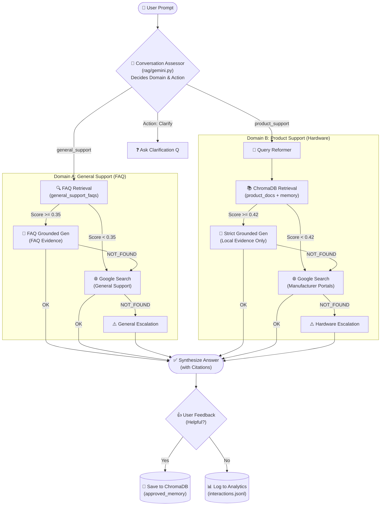

# Intelligent Product Support Assistant

A chat-first, grounded product support assistant designed for consumer hardware and software products. It combines multi-turn conversational clarification, local vector document retrieval (RAG), live Google Search grounding fallback, and verified source citations while strictly preventing hallucinated technical advice.

---

## Architecture & Methodology



### Core Methodology

1. **Natural Multi-Turn Clarification**: Before querying documentation, the model analyzes the conversation history. If the product, model, or issue is ambiguous, it asks a single, concise follow-up question (under 30 words) instead of guessing.
2. **Local Documentation First**: If product documentation (PDF, Markdown, TXT) or support URLs have been added, the assistant retrieves relevant chunks partitioned by product workspace.
3. **Google Search Grounding Fallback**: When local documentation is missing or insufficient, Gemini performs grounded web research against official manufacturer support resources.
4. **Zero-Hallucination Guardrail & Safe Escalation**: If evidence is missing, contradictory, or hardware-version mismatched, the assistant explicitly escalates with a link to official support rather than inventing procedures or pinouts.
5. **Human-in-the-Loop Interaction Memory**: High-quality answers marked "Helpful" by users are saved to a separate persistent memory vector collection to improve future responses without overwriting official documentation.

---

## Tech Stack

| Component | Technology | Purpose |
|---|---|---|
| **Interface** | Streamlit | Chat UI, document uploader, URL ingestor, and workspace viewer |
| **LLM & Vision** | Google Gemini (`gemini-2.5-flash`) | Conversation assessment, product extraction, and grounded generation |
| **Embeddings** | Gemini (`gemini-embedding-001`) | 768-dimensional semantic embeddings for document chunks & queries |
| **Live Research** | Google Search Grounding via `google-genai` | Fallback research with API-verified web source citations |
| **Vector Store** | ChromaDB (Persistent) | Local vector storage partitioned by product slug and interaction memory |
| **Document Parsers** | `pypdf`, `BeautifulSoup4`, `requests` | Ingestion of PDF manuals, Markdown, TXT FAQs, and public support URLs |
| **Interaction Store** | JSONL (`data/interactions.jsonl`) | Local audit trail of queries, answers, citations, and feedback |
| **Test & Eval** | `pytest`, custom CLI runner | Unit test suite and golden-question benchmark evaluation |

---

## Quickstart & Installation

Run the following commands in your terminal to set up and start the application:

```bash
# 1. Clone the repository and navigate into the directory
git clone https://github.com/sh1r0yaksh4/Intelligent-Product-Support-Assistant.git
cd "Intelligent Product Support Assistant"

# 2. Create and activate a virtual environment
python3 -m venv .venv
source .venv/bin/activate

# 3. Install dependencies
pip install -r requirements.txt

# 4. Set up your environment variables
cp .env.example .env
# Edit .env and add your GEMINI_API_KEY:
# GEMINI_API_KEY="your-api-key-here"

# 5. (Optional) Load the bundled demo product (TP-Link Archer AX21)
python3 scripts/load_demo.py

# 6. Launch the Streamlit application
streamlit run app.py
```

> [!TIP]
> Always ensure your virtual environment is active (`source .venv/bin/activate`) before running commands, or prefix commands with `.venv/bin/python3`.

---

## Usage Guide

### 1. Conversational Support with Clarification
Ask naturally about any product. If you provide incomplete information, the assistant will ask a quick clarifying question:
- *User*: `My headphones keep disconnecting.`
- *Assistant*: `Which brand and model of headphones are you using?`
- *User*: `Sony WH-1000XM5`
- *Assistant*: `[Provides verified Bluetooth multipoint troubleshooting steps with citations]`

### 2. Ingesting Product Documentation
Open the expander **"Add trusted product documents or a support URL"** at the top of the app:
- **Product Name**: Enter product identifier (e.g. `TP-Link Archer AX21`).
- **File Upload**: Upload official `.pdf`, `.md`, or `.txt` manuals.
- **Web URL**: Paste an official support page URL to fetch and index it locally.
- **Rebuild Index**: Recompute vector embeddings for that product workspace.

### 3. Feedback Loop
Click **Helpful** or **Not Helpful** under assistant responses:
- **Helpful**: Promotes verified, cited answers into the approved interaction memory collection.
- **Not Helpful**: Logs feedback for review without indexing it as memory.

---

## Repository Structure

```text
├── app.py                      # Streamlit chat interface and document ingest UI
├── pyproject.toml              # Project configuration and pytest settings
├── requirements.txt            # Python dependencies
├── .env.example                # Template for environment configuration
│
├── rag/                        # Core RAG & LLM pipeline
│   ├── chatbot.py              # Assistant coordinator (clarification, RAG, fallback)
│   ├── config.py               # Constants, directory paths, and model settings
│   ├── gemini.py               # Gemini API client, embeddings, and grounding
│   ├── indexer.py              # ChromaDB vector indexer & approved memory manager
│   ├── interactions.py         # JSONL interaction logging and feedback processing
│   ├── loader.py               # PDF, Markdown, and TXT chunking and parsing
│   ├── models.py               # Data classes (ChatResult, Citation, DocumentChunk)
│   ├── ocr.py                  # Graceful OCR fallback for image-only PDFs
│   ├── retriever.py            # ChromaDB vector retrieval with similarity filtering
│   └── sources.py              # Local file storage and support URL scraper
│
├── data/
│   ├── examples/               # Bundled sample product guides for demoing
│   ├── products/               # Local indexed product files (git-ignored)
│   └── interactions.jsonl      # Local interaction and feedback log (git-ignored)
│
├── evaluation/
│   ├── golden_questions.csv    # Golden benchmark dataset for quality testing
│   └── run_eval.py             # CLI evaluation benchmark runner
│
├── scripts/
│   ├── load_demo.py            # Quickstart script to index demo products
│   └── reindex.py              # Command-line tool to reindex a product workspace
│
└── tests/
    ├── test_chatbot.py         # Unit tests for clarification, context, queries, feedback
    ├── test_loader.py          # Unit tests for document parsers and chunking
    └── test_retriever.py       # Unit tests for vector retrieval and scoring
```

---

## Testing & Quality Evaluation

### Run Unit Tests
```bash
pytest -v
```

### Run Golden Benchmark Evaluation
To evaluate live answer accuracy, citation presence, and escalation behavior against the benchmark test set:

```bash
python3 evaluation/run_eval.py
```
*(Requires `GEMINI_API_KEY` in `.env`)*
